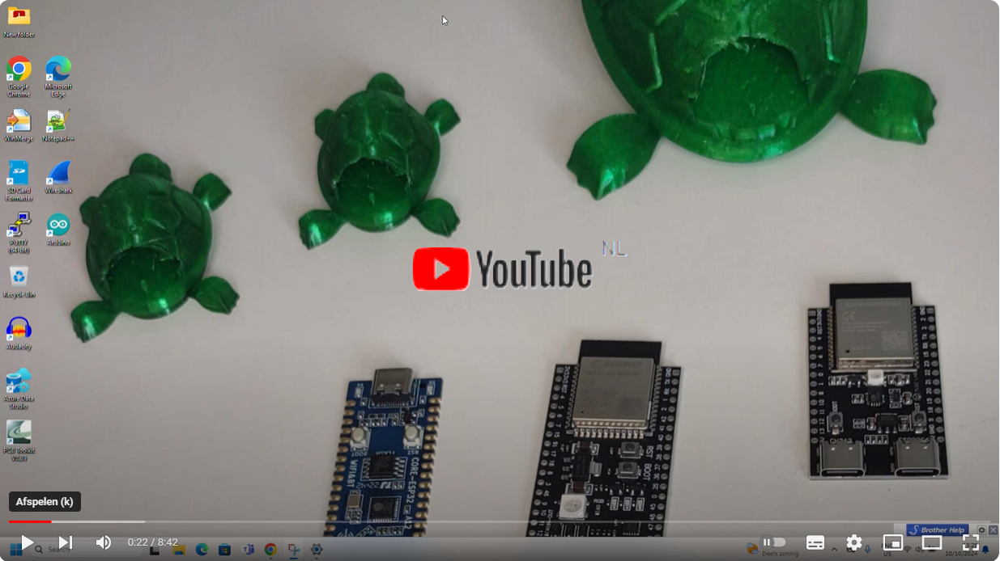

  

# Turtle-ESP-mouse-jiggler

Mouse jiggler of the ESP USB and BLE
Have a look at the [Youtube](https://www.youtube.com/watch?v=TNNkfE2sDhM) introduction 

*This example turns the ESP32 into a Bluetooth LE mouse and USB that continuously moves the mouse.

  
|||Supported |BLE |USB
|--|--|--|--|--|
|[ESP32](https://www.espressif.com/sites/default/files/documentation/esp32_datasheet_en.pdf)|>=4MB| Yes| Yes| No
|[ESP32-S2](https://www.espressif.com/sites/default/files/documentation/esp32-s2_datasheet_en.pdf)|>=4MB| Yes| No| Yes
|[ESP32-S3](https://www.espressif.com/sites/default/files/documentation/esp32-s3_datasheet_en.pdf)|>=4MB| Yes| Yes| Yes
|[ESP32-C2/ESP8684(H2/H4)](https://www.espressif.com/sites/default/files/documentation/esp8684_datasheet_en.pdf)|>4MB| Notyet |Yes |No
|[ESP32-C3](https://www.espressif.com/sites/default/files/documentation/esp32-c3_datasheet_en.pdf) |>=4MB|Yes |Yes |No
|[ESP32-C5](https://www.erlendervik.no/ESP32-C5%20Beta_ESP32-P4_ESP8686_ESP32-C3FH4X/ESP32_C5_Chip_Datasheet_V0.1_PRELIMINARY_EN.pdf) |>=4MB|Notyet |Yes |Yes
|[ESP32-C6](https://www.espressif.com/sites/default/files/documentation/esp32-c6_datasheet_en.pdf) |>=4MB|Yes* |Yes |No
|[ESP32-C61](https://www.espressif.com/en/news/ESP32-C61_SoC) |>=4MB|Notyet |Yes |No
|[ESP32-H2](https://www.espressif.com/sites/default/files/documentation/esp32-h2_datasheet_en.pdf) |>=4MB|Yes* |Yes |No
|[ESP32-P4](https://docs.espressif.com/projects/esp-idf/en/v5.3/esp32p4/esp-idf-en-v5.3-esp32p4.pdf) ||No |No |No
|[ESP8266](https://www.espressif.com/sites/default/files/documentation/0a-esp8266ex_datasheet_en.pdf) ||No |No |No

*Yes is supported by Arduino but not yet by Platformio 2024-09  
*Notyet is not yet supported as i do not have the Chip or Platform software 2024-09

## You can program ESP32 board 
With this [Link](https://emilespecialproducts.github.io/Turtle-ESP-mouse-jiggler/firmware/upload.html)

## You can find some Turtle 3d Print box 
At this [link](https://www.tinkercad.com/things/ebTFXCaYhMz-mouse-jiggler-of-the-esp-usb-and-ble)
